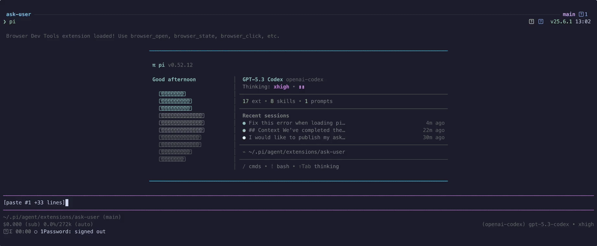

# pi-ask-user

A Pi package that adds an interactive `ask_user` tool for collecting user decisions during an agent run.

## Demo



High-quality video: [ask-user-demo.mp4](./media/ask-user-demo.mp4)

## Features

- Searchable single-select option lists with wrapped titles and descriptions
- Responsive split-pane details preview on wide terminals with single-column fallback on narrow terminals
- Multi-select option lists
- Optional freeform responses
- User-toggleable extra context on structured selections
- Context display support
- Overlay mode — dialog floats over conversation, preserving context
- Pi-TUI-aligned keybinding and editor behavior
- Custom TUI rendering for tool calls and results
- System prompt integration via `promptSnippet` and `promptGuidelines`
- Optional timeout for auto-dismiss in both overlay and fallback input modes
- Structured `details` on all results for session state reconstruction
- Graceful fallback when interactive UI is unavailable
- Bundled `ask-user` skill for mandatory decision-gating in high-stakes or ambiguous tasks

## Bundled skill: `ask-user`

This package now ships a skill at `skills/ask-user/SKILL.md` that nudges/mandates the agent to use `ask_user` when:

- architectural trade-offs are high impact
- requirements are ambiguous or conflicting
- assumptions would materially change implementation

The skill follows a "decision handshake" flow:

1. Gather evidence and summarize context
2. Ask one focused question via `ask_user`
3. Wait for explicit user choice
4. Confirm the decision, then proceed

See: `skills/ask-user/references/ask-user-skill-extension-spec.md`.

## Install

```bash
pi install npm:pi-ask-user
```

## Tool name

The registered tool name is:

- `ask_user`

## Parameters

| Parameter | Type | Default | Description |
|-----------|------|---------|-------------|
| `question` | `string` | *required* | The question to ask the user |
| `context` | `string?` | — | Relevant context summary shown before the question |
| `options` | `(string \| {title, description?})[]?` | `[]` | Multiple-choice options |
| `allowMultiple` | `boolean?` | `false` | Enable multi-select mode |
| `allowFreeform` | `boolean?` | `true` | Add a "Type something" freeform option |
| `allowComment` | `boolean?` | `false` | Expose a user-toggleable extra-context option in the overlay (`ctrl+g` or the toggle row) and collect an optional comment in fallback dialogs |
| `timeout` | `number?` | — | Auto-dismiss after N ms and return `null` if the prompt times out |

## Example usage shape

```json
{
  "question": "Which option should we use?",
  "context": "We are choosing a deploy target.",
  "options": [
    "staging",
    { "title": "production", "description": "Customer-facing" }
  ],
  "allowMultiple": false,
  "allowFreeform": true,
  "allowComment": true
}
```

## Result details

All tool results include a structured `details` object for rendering and session state reconstruction:

```typescript
type AskResponse =
  | { kind: "selection"; selections: string[]; comment?: string }
  | { kind: "freeform"; text: string };

interface AskToolDetails {
  question: string;
  context?: string;
  options: QuestionOption[];
  response: AskResponse | null;
  cancelled: boolean;
}
```

## Changelog

See [CHANGELOG.md](./CHANGELOG.md).